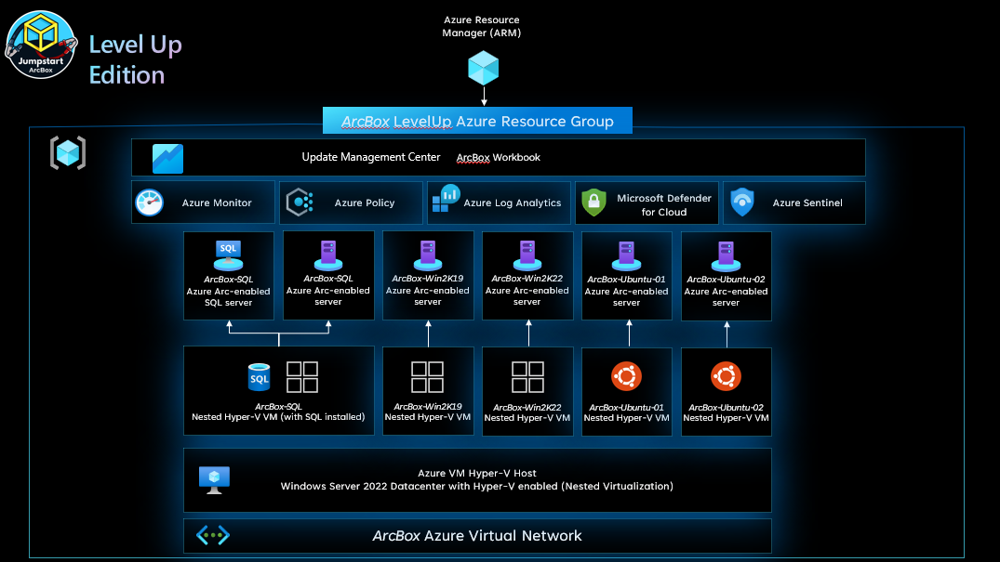
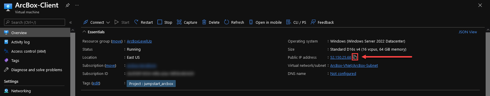

# Azure Arc-enabled servers LevelUp Training



The following README will guide you on how to automatically deploy an ArcBox for use with the Azure Arc-enabled servers LevelUp training.

## Prerequisites

* ArcBox LevelUp requires 16 DSv3-series vCPUs when deploying with default parameters such as VM series/size. Ensure you have sufficient vCPU quota available in your Azure subscription and the region where you plan to deploy ArcBox. You can use the below Az CLI command to check your vCPU utilization.

  ```shell
  az vm list-usage --location "<location>" --output table
  ```

  

* [Install or update Azure CLI to version 2.25.0 and above](https://docs.microsoft.com/en-us/cli/azure/install-azure-cli?view=azure-cli-latest). Use the below command to check your current installed version.

  ```shell
  az --version
  ```

* Create Azure service principal (SP).

  You will need `Microsoft.Authorization/roleAssignments/write` permission on the target subscription in order to successfully assign the appropriate permissions to the Service Principal used in the automation. Azure built-in roles which contain this permission are as follows:

  * [Owner](https://docs.microsoft.com/en-us/azure/role-based-access-control/built-in-roles#owner)
  * [User Access Administrator](https://docs.microsoft.com/en-us/azure/role-based-access-control/built-in-roles#user-access-administrator)
  * [Co-Administrator](https://docs.microsoft.com/en-us/azure/role-based-access-control/classic-administrators)

  For additional information on assigning a user as a Subscription administrator, click [here](https://docs.microsoft.com/en-us/azure/role-based-access-control/role-assignments-portal-subscription-admin)

  To be able to complete the scenario and its related automation, Azure service principal assigned with the “Contributor” role on the subscription is required. To create it, login to your Azure account run the below command (this can also be done in [Azure Cloud Shell](https://shell.azure.com/)).

  ```shell
  az login
  az account set --subscription "<Subscription Id>"
  az ad sp create-for-rbac -n "<Unique SP Name>" --role contributor
  ```

  For example:

  ```shell
  az ad sp create-for-rbac -n "http://AzureArcLevelUp" --role contributor
  ```

  Output should look like this:

  ```json
  {
      "appId": "XXXXXXXXXXXXXXXXXXXXXXXXXXXX",
      "displayName": "AzureArcLevelUp",
      "name": "http://AzureArcLevelUp",
      "password": "XXXXXXXXXXXXXXXXXXXXXXXXXXXX",
      "tenant": "XXXXXXXXXXXXXXXXXXXXXXXXXXXX"
  }
  ```

  > **Note: It is optional, but highly recommended, to scope the SP to a specific [Azure subscription](https://docs.microsoft.com/en-us/cli/azure/ad/sp?view=azure-cli-latest).**

## ArcBox Azure Region Compatibility

ArcBox must be deployed to one of the following regions:
> **Deploying ArcBox outside of these regions may result in unexpected results or deployment errors.**

* East US
* East US 2
* West US 2
* North Europe
* France Central
* UK South
* Southeast Asia

## Deploy the Template from the Azure Portal

1. Click the button below to deploy the LevelUp ArcBox template via the Azure Portal:

    [](https://portal.azure.com/#create/Microsoft.Template/uri/https%3A%2F%2Fraw.githubusercontent.com%2FDigital-Sales-CSA-Portal%2FAzureARC_LevelUP%2Fmain%2Farm%2Fazuredeploy.json/createUIDefinitionUri/https%3A%2F%2Fraw.githubusercontent.com%2FDigital-Sales-CSA-Portal%2FAzureARC_LevelUP%2Fmain%2Farm%2FcreateUiDefinition.json)

2. Choose a target subscription, region, resource group (or create a new one), and region. Click **next**:

    

3. Fill in your IP from [icanhazip.com](http://www.icanhazip.com), the corresponding fields from the Service Principal creation step above, and the Windows VM login credentials. Click **next**:

    

    > Please make sure to select a **unique** value for the Log Analytics Workspace Name (e.g. it doesn't overlap any existing Log Analytics Workspace within the target Resource Group)

    > Note: If [icanhazip.com](http://icanhazip.com) isn't working properly for you, you can also try [whatismyip.com](http://whatismyip.com) or [ipinfo.io/ip](http://ipinfo.io/ip)

4. Review the deployment details, then click **create** to begin the deployment:

    

5. Once the deployment has finished, click **go to resource group***:

    

6. Select the **ArcBox-Client** virtual machine:

    

7. Copy the **Public IP** by clicking the copy icon to the right of it:

    

8. Paste the copied **Public IP** into a Remote Desktop window, and click **Connect**:

    

9. Watch and wait for the post-deployment automation script to finish:

    

10. Once the scripts have completed, you should have 2 Linux, 2 Windows VM's, and a Windows SQL VM which can be found in **Hyper-V Manager** on the desktop:

    


## Required Credentials

Use the below credentials for logging into the nested Hyper-V virtual machines:

* Windows Server (2019/2022/SQL)
  * Username: `Administrator`
  * Password: `ArcDemo123!!`
* Linux (Ubuntu/CentOS)
  * Username: `arcdemo`
  * Password: `ArcDemo123!!`

## Lets On Board These Server to Azure using ARC

* [Windows Server 2019 using Single Server Script](Docs/2019.md)
* [Windows Server 2022 using Service Primcipal](Docs/2022_SP.md)
* [Ubuntu Server 01 using Single Server Script](2019.md)
* [Ubuntu Server 02 using Single Server Script](2019.md)
* [Windows SQL Server using Single Server Script](Docs/AzureSQL.md)
